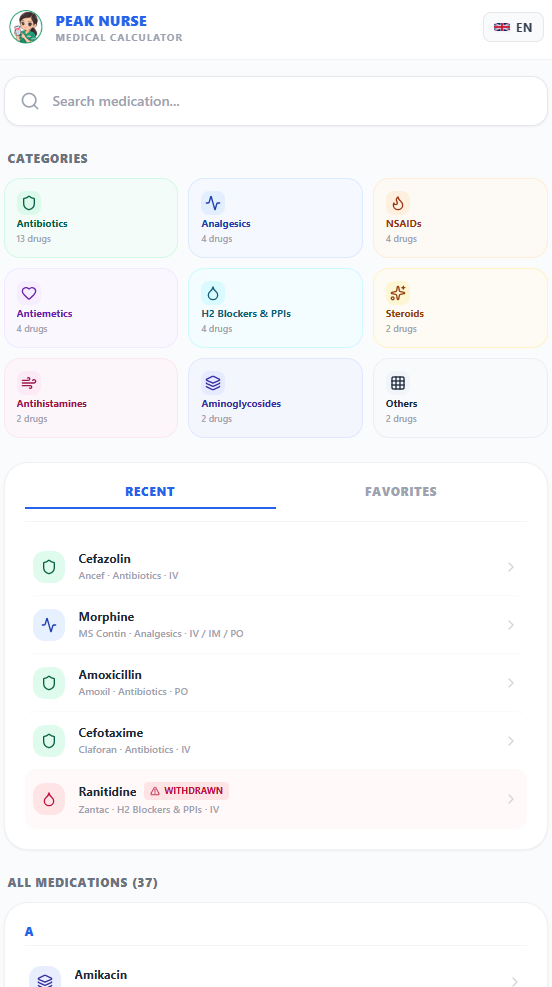
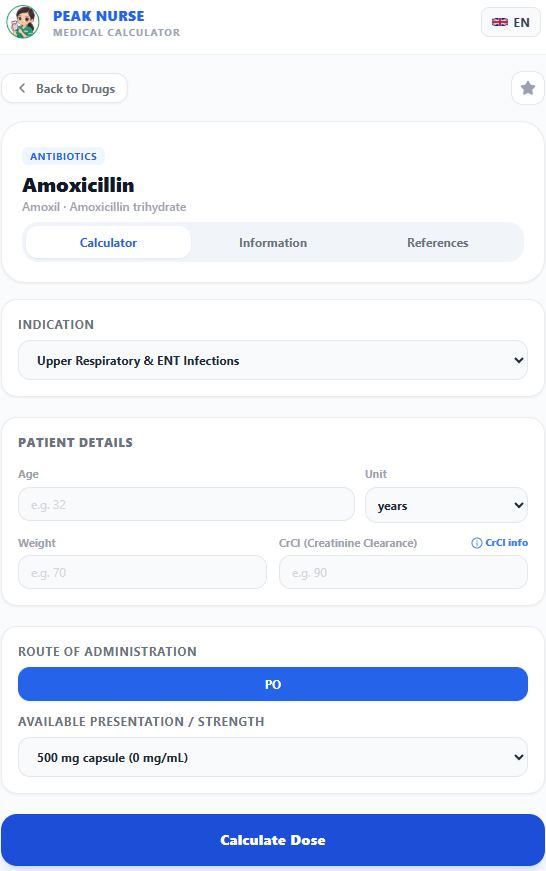
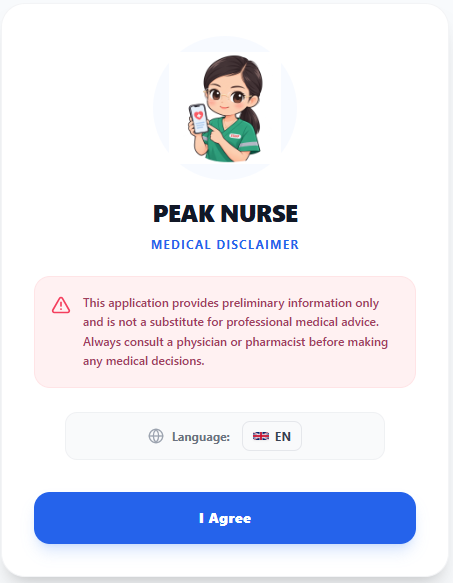

<div align="center">

# 🩺 Peak Nurse Medical Calculator

[](https://react.dev/)
[](https://www.typescriptlang.org/)
[](https://vite.dev/)
[](https://tailwindcss.com/)
[](https://web.dev/progressive-web-apps/)
[](LICENSE)

A professional, evidence-based medication dosing calculator and clinical reference Progressive Web App (PWA) designed for registered nurses, clinical pharmacists, and healthcare professionals.

[Key Features](#-key-features) • [Tech Stack](#-tech-stack) • [Installation](#-getting-started) • [Clinical Verification](#-clinical-verification--safety) • [Disclaimer](#-medical-disclaimer)

</div>

---

## 📖 Overview

**Peak Nurse Medical Calculator** is a high-precision clinical decision-support tool engineered to eliminate medication calculation errors at the bedside. It provides rapid, reliable, evidence-based pediatric, neonatal, and adult dosing calculations, reconstitution guidelines, dilution factors, and comprehensive pharmacological references tailored for hospital wards, emergency departments, and critical care units.

---

## 🎯 Project Goal

To bridge the gap between complex pharmacological reference manuals and fast-paced bedside nursing care by offering:
- **Instantaneous, error-free dose computation** based on patient-specific parameters (weight, age, renal function, route).
- **Multi-population support** including neonatal, pediatric, adult, and geriatric dosing algorithms.
- **Strict safety boundaries** with automated minimum/maximum dose checks, renal/hepatic adjustments, and clinical alerts.
- **Multilingual accessibility** (English, Russian, and Thai) supporting international clinical environments and Thai National Essential Medicines List (NLEM) formularies.

---

## 🌟 Key Features

### 1. 🔍 Smart Search & Categorized Navigation
- Instant predictive lookup by generic name, brand name, or active ingredient.
- Category filtering: *Emergency, Analgesics & NSAIDs, Antibiotics & Anti-infectives, Gastrointestinal, Corticosteroids, Antiemetics*, and more.
- Quick access to **Recent Medications** and **Favorites** stored locally on the device.

### 2. 🧮 Multi-Parameter Calculation Engine
- **Weight-Based Dosing:** mg/kg or mcg/kg computation with automatic single-dose and daily-dose limits.
- **Age-Stratified Protocols:** Automatic classification into neonatal, pediatric, and adult protocols.
- **Renal Function Adjustments:** Creatinine Clearance (CrCl) based dosage modification tiers.
- **Volume & Reconstitution:** Automatic conversion of mass doses (mg/g) into liquid volume (mL) based on available vial strengths.

### 3. 📑 Tabbed Medication Details
Each medication record is structured into three intuitive clinical tabs:
- **Calculator Tab:** Dynamic input fields for weight, age, CrCl, gender, routes (IV, IM, PO), and indications, generating transparent formula calculation steps.
- **Information Tab:** Pharmacology summary, mechanism of action, administration guidelines, infusion rates, contraindications, and adverse effects.
- **References Tab:** Citations from authoritative medical guidelines (FDA, EMA, BNF/BNFC, GINA, IDSA, AHA, Surviving Sepsis, Endocrine Society).

### 4. 🌍 Multi-Language Localization
- Fully localized interface supporting **English**, **Russian (Русский)**, and **Thai (ภาษาไทย)** via `i18next`.

### 5. 📱 Progressive Web App (PWA)
- Fully responsive mobile-first design optimized for tablets and smartphones at the bedside.
- Offline-capable with service worker caching for reliable performance in hospital zones with weak connectivity.

---

## 📸 Interface Screenshots

### Application Interface & Workflows
*Real screenshots showcasing the application interface, search, categories, and calculator:*

#### Home & Search Screen


#### Medication Calculation & Dosing Tab


#### Welcome / Disclaimer Screen


---

## 🛠️ Tech Stack

- **Frontend Framework:** React 19 + TypeScript
- **Build Tool:** Vite 8
- **Styling:** Tailwind CSS 3
- **Internationalization:** i18next & react-i18next
- **Icons:** Lucide React
- **Testing:** Vitest & React Testing Library
- **PWA Integration:** vite-plugin-pwa (Service Workers & Web App Manifest)
- **Linting:** Oxlint

---

## 🚀 Getting Started

### Prerequisites
- Node.js (v18+ recommended)
- npm or pnpm

### Installation

1. Clone the repository:
   ```bash
   git clone https://github.com/your-username/peak-nurse-medical-calculator.git
   cd peak-nurse-medical-calculator
   ```

2. Install dependencies:
   ```bash
   npm install
   ```

3. Run the development server:
   ```bash
   npm run dev
   ```

4. Build for production:
   ```bash
   npm run build
   ```

5. Run unit tests:
   ```bash
   npm test
   ```

---

## 📋 Clinical Verification & Safety

The medication database powering Peak Nurse includes rigorous clinical verification against authoritative international and national standards (FDA SPL, EMA SPC, BNF/BNFC, Thai NLEM). 
- All calculations undergo automated unit testing (`src/utils/__tests__/calculationEngine.test.ts`) to ensure mathematical and clinical accuracy.
- Strict safety guardrails flag out-of-range dosing inputs and contraindications.

---

## ⚠️ Medical Disclaimer

> **IMPORTANT NOTICE:** Peak Nurse Medical Calculator is intended solely as an educational and clinical decision-support tool for qualified healthcare professionals (registered nurses, pharmacists, and physicians). It **does not** replace professional clinical judgment, patient assessment, or institutional hospital policies. Healthcare providers must independently verify all calculations, drug compatibilities, and dosages before clinical administration. The developers assume no liability for medication errors or clinical outcomes.

---

## 📄 License

Distributed under the MIT License. See [LICENSE](LICENSE) for more information.
